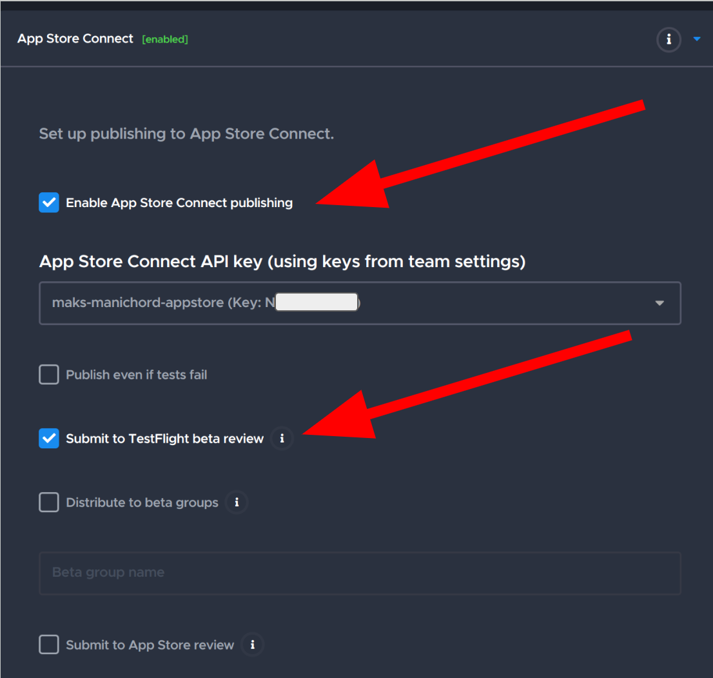

# Publish your first Flutter app to the App Store

[Codelab Feedback](https://github.com/codemagic-ci-cd/codelabs/issues)

## Introduction

**Last Updated:** 2025-02-28

In this tutorial, you will be going through all the steps necessary to build, sign and deploy a Flutter app to the Apple App Store.

### **What you'll build**

* A basic new Flutter app 
* A single workflow project for it on Codemagic
* A signed IPA file that can be installed directly on devices, distributed via TestFlight, or submitted for review to the Apple App Store

> aside negative
> 
> **Note:** To simplify this tutorial, and explain the fundamentals of the process of publishing your first Flutter app to the App Store with CI/CD, we will use Codemagic's Workflow Editor, though you can switch to using YAML for your project's workflow configuration afterwards if you wish.

### **What you'll learn**

* How to create a new Flutter app project on Codemagic
* How to set up an account on Apple App Store connect
* How to build and sign your iOS app
* How to deploy your app to Apple TestFlight and the App Store

### **What you'll need**

* The Flutter SDK installed on your Windows, Linux or macOS computer
* A  ***PAID*** Apple Developer account
* A GitHub (or GitLab or Bitbucket) account
* A Codemagic account
* An iOS device


## Getting set up

If you don't yet have an account with a Git provider, you can create  [a new one with GitHub here](https://github.com/signup).

If you don't yet have a **PAID** Apple Developer account, you can  [begin the process of creating a new one here](https://developer.apple.com/programs/enroll/). Note that you will need to provide Apple with several pieces of information and pay $99 USD per year for your account (or the equivalent amount in your country, as of the time of this writing). Once you get to the end of the process and see a screen like this:


you are almost finished with the process.

Apple splits the tools for managing developer and app information between the Apple Developer website and the App Store Connect website. These sites can be confusing for newcomers due to their complex processes and interfaces. To simplify things, this tutorial will use Codemagic’s features to minimize interactions with both sites.

## Your Flutter app

In order to publish your app to the App Store, you will first need an app! 

Before we begin, make sure you are using the latest current version of the Flutter SDK stable channel:

```
flutter --version
Flutter 3.10.0 • channel stable • https://github.com/flutter/flutter.git
Framework • revision 84a1e904f4 (7 days ago) • 2023-05-09 07:41:44 -0700
Engine • revision d44b5a94c9
Tools • Dart 3.0.0 • DevTools 2.23.1
```

The specific versions above are not important. What matters is that the output includes the text: **`• channel stable •`**, as shown in the example.  

For this tutorial, we will use a Flutter app based on the default "Counter app" that is generated when you run the Flutter `create` command.

You can create the app now by running:

```
flutter create classic_counter
```

### **Naming your app**

An essential step in creating our app, which will be necessary for publishing it on TestFlight and the App Store, is creating a unique identifier for it. On Apple platforms, this identifier is the ***Bundle ID***.

> aside negative
> 
> **Note:** The Bundle ID must be ***unique***, so choose an ID that is specific to your project. Do not use the one shown in the examples or the default ID generated by the Flutter `create` command. A good practice is to use a reverse domain name. For example, if we have `codemagic.io`, then a suitable Bundle ID would be: `io.codemagic.classicCounter`.

According to the [Flutter documentation](https://docs.flutter.dev/deployment/ios#register-your-app-on-app-store-connect), you first need to go to the Apple Developer site, log in, and start creating a new app identifier:


Subsequent steps in the process will ask you to choose the identifier type:


and finally enter your chosen Bundle ID:


Once you have completed all the steps to create the app identifier, you should see it listed under your Apple Developer account under the **Identifiers** section:


Now we need to follow the  [next process of creating an application record on App Store Connect](https://docs.flutter.dev/deployment/ios#create-an-application-record-on-app-store-connect).

First select **My Apps**:


Then click on the "+" icon to add a new entry:


Select **New App** from the drop down and then fill in the form shown:


Note that in the **Bundle ID** drop down you should see and be able to select the Bundle ID you created previously in the Apple Developer website. 

You now need to update your Flutter app code to use the Bundle ID you have chosen. The easiest way to do this is by using Xcode. You can follow the instructions for this in [the Flutter documentation](https://docs.flutter.dev/deployment/ios#review-xcode-project-settings).

Now that you have updated your app, you need to add it to a Git repository and push it to a Git hosting provider (e.g., GitHub). You have to create a new repository with the hosting provider ***first***:

```
cd classic_counter
git init .
git commit -a -m "app scaffold"
git add remote origin <git-hosting-provider-url>
git push origin main
```


## Building your iOS app on Codemagic

You will start by building your app for iOS without code signing on Codemagic.

To set up your app on Codemagic, you first need to create the project by connecting a Git hosting provider (e.g., GitHub):


Then select a repository and the Flutter project type:


You then need to configure a few settings for your new app project on Codemagic. First check that only iOS is selected as the platform:


Then that the versions are set to `channel Stable` for Flutter, `Latest` for Xcode and `default` for Cocoapods:


And that the build mode is set to `Debug`:


Once you have made those changes to the settings, click "Save changes" button in the top right hand corner:


and then you can start your first build by clicking on the "Start your first build" button:


After your first build, this button will change to "Start new build":


Once your build successfully completes, you will have an **unsigned** artifact that you will be able to run *only* on the iOS Simulator.


## Signing your iOS app on Codemagic

Codemagic supports both automatic and manual processes to sign your app. In this tutorial, we will only cover automatic code signing, as it is by far the easier process, especially for newcomers to iOS code signing.

### **What is code signing?**

Before diving into the technical details, it's important to understand what code signing is and why it's essential for app development.

In general terms, code signing is a cryptographic process by which certificates, made up of corresponding public and private keys, are used to create a "hash" value of some data (e.g., the executable code and resources that make up an app). The private key is used in such a way that the public key can later confirm that only someone possessing the private key could have created (calculated) that hash value for the given app.

#### **Code Signing for iOS Apps** ####
In the context of Apple and iOS apps, code signing ensures that [only apps explicitly authorized by Apple can run on Apple platforms](https://developer.apple.com/documentation/technotes/tn3125-inside-code-signing-provisioning-profiles#Provisioning-profile-fundamentals), such as iOS devices. This is achieved through the use of Provisioning Profiles.

Provisioning Profiles are files that can only be created through the Apple Developer website. They specify:

* Who can sign the app.
* Where the app can run.
* What the app is entitled to do.

These profiles store information such as the certificate used to sign the app, the app’s unique identifier, and other metadata, including the unique IDs of the devices on which the app is allowed to run.

#### **Why Only Apple Can Create Provisioning Profiles** ####
Only the Apple Developer website can create provisioning profiles because they are signed by Apple using a certificate they exclusively hold. This is what ensures the security and authenticity of apps on Apple devices.

#### **Provisioning Profiles in Detail** ####
The Provisioning Profile is central to the code signing process on iOS (and all Apple platforms). More detailed information about them can be found in the [Apple technote on the subject](https://developer.apple.com/documentation/technotes/tn3125-inside-code-signing-provisioning-profiles).

It's important to note that each app may have multiple provisioning profiles:

* ***Ad-Hoc Provisioning Profiles*** — Used for distributing an app to a small number of users (or testers) directly. In this case, you need to add the device UDIDs manually into the Apple Developer portal.
* ***App Store Provisioning Profile*** — Used for uploading your app build to App Store Connect for distribution via TestFlight or the public App Store.

#### **How Codemagic Simplifies Code Signing** ####

Fortunately, for this tutorial, most of the complexities of obtaining, managing, and using provisioning profiles can be handled by Codemagic through the App Store Connect API.

However, to allow Codemagic to manage this on behalf of your app, you first need to obtain an ***App Store Connect API key***. The process to do so is as follows:

1. Log in to App Store Connect and navigate to **Users and Access &gt; Integrations**.
2. Click on the "+" sign on the **Team Keys** tab to generate a new API key.
3. Enter a name for the key and select an access level.

We recommend choosing App Manager, as the Developer role does not have the required permissions to upload to the store. Read more about Apple Developer Program role permissions [here](https://developer.apple.com/help/app-store-connect/reference/role-permissions/).

4. Click "Generate". Once the key is generated, it will be added to the list of active keys.
5. Click "Download API Key" to save the private key for later use. Note: The key can only be downloaded once.

This process is also covered in [this section of the Codemagic documentation](https://docs.codemagic.io/flutter-code-signing/ios-code-signing/#step-1-creating-an-app-store-api-key-for-codemagic).

Once you have obtained an API key, keep it along with the **Issuer ID** and **Key ID**, which can be found on the App Store Connect website. You will need them in the next step.:


Then, add them to your **Team/Account** section in the Codemagic web app:


If you prefer to a see a demonstration, the above process of how to obtain and use the API key  [is covered in this video](https://www.youtube.com/watch?v=aBDx6BKFXIA).

#### **Registering your test devices**

You will want to test your app on at least one actual iOS device, so you will need to register that device on your Apple Developer account **prior** to building your first **signed** iOS artifact. 

To add your devices to your profile, you will need to go to the **Devices** section of the Apple Developer web console and click on the + button:


Specific instructions on how to obtain the required UUID of each of your iOS devices can be found  [in the Apple developer documentation](https://developer.apple.com/documentation/xcode/distributing-your-app-to-registered-devices#Collect-device-identifiers-iOS-iPadOS-tvOS-watchOS).

Now, moving back to the ***Codemagic web interface***: in your app workflow editor configuration, you will need to go to the Distribution section and make sure that the code signing method is set to `Automatic` and that the **App Store Connect API key** and **Bundle Identifier** match those that you set up in the previous parts of this step:


Now that you have done all the required preparation, you can start a new build of your app on Codemagic using the start new build button as you did previously. Once the build is successful, you will have a **signed** artifact that you can download and install on your iOS device.


> aside negative
> 
> **Note:** Codemagic provides a very handy feature, where by clicking on the QR code icon next to the IPA artifact file name you will get a QR code with the download link to the file, very handy to quickly download and install it with your iPhone or iPad.


If the build fails because of an error message like this, it means you have too many existing distribution certificates on your account. You can remove the ones that are not used or choose manual code signing and upload your existing profiles and distribution certificates following the docs [here](https://docs.codemagic.io/flutter-code-signing/ios-code-signing/#manual-code-signing)

## Uploading your app to TestFlight

Now that you have a working signed build, the next step is to upload it to TestFlight to make it more easily available to others to install and test your app. 

To set up uploading to TestFlight you will need to again go to the **Distribution** section of your apps workflow editor in Codemagic. This time open the **App Store Connect** instead of the **iOS code signing** subsection:


In that section you will need to ensure that both the **Enable App Store Connect** publishing and **Submit to TestFlight beta review** items are enabled:



Once the build workflow completes successfully, you should see your app build listed under the **TestFlight** tab on the App Store Connect website:


On your iOS device, open the App Store and download the TestFlight app to install your app.


## Publishing your app to the App Store

Once you have finished testing and are ready to publish your app to the App Store, the final step is to submit it for review. To do this, simply run your build on Codemagic again, this time enabling the option under the **Codemagic App Store Connect** section to submit the app for review:


## Next Steps

Congratulations! 

You have now published your first Flutter app to the Apple App Store!

### **What we've covered**

✅ Created a new Flutter app project on Codemagic

✅ Setup an account on Apple App Store connect

✅ Built and signed your iOS app

✅ Deployed your app to Apple TestFlight and the App Store

### **What next?**

* Configure build versioning by switching to using a YAML configuration file stored in your Git repository.
* Duplicate your workflows to keep release and development workflows separated.
* Add more platforms to your project on Codemagic such as Android, MacOS, Linux, Windows and Web to make your app available to users on all those platforms.


